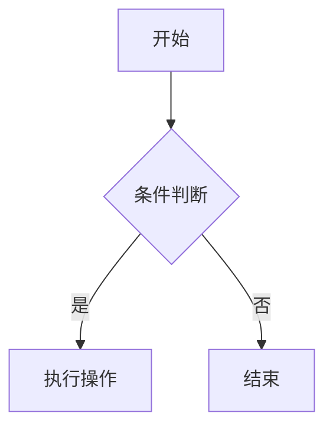

---
# 文章标题（中文）
title: "Markdown常用语法"
# 文章发布日期（中文格式）
date: 2025-03-25
# 文章标签（中文标签）
tags: ["Markdown", "基础教程"]
# 文章分类（中文分类）
categories: ["Markdown"]
# 文章是否为草稿状态
draft: false
# 文章SEO描述（中文）
description: "本文介绍Markdown常用语法，适合新手入门学习。"
---


以下是一个结构清晰、内容详实的Markdown语法指南文档：

# Markdown 语法权威指南

## 一、基础语法体系

### 1. 标题层级
```markdown
# 一级标题（最大）
## 二级标题
### 三级标题
#### 四级标题
##### 五级标题
###### 六级标题（最小）
```

### 2. 段落格式
普通文本直接输入，换行需保留两个空格或使用空行分隔：

这是一段普通文本。  
这是另一段换行文本。

### 3. 列表系统
**无序列表**（支持嵌套）：
```markdown
- 主项目
  - 子项目
    - 孙项目
```

**有序列表**（支持自定义编号）：
```markdown
1. 步骤一
2. 步骤二
   1. 子步骤
   2. 子步骤
```

### 4. 强调格式
```markdown
*斜体* **加粗** ~~删除线~~ `代码`
```

### 5. 引用块
```markdown
> 这是一段引用
> > 嵌套引用
> 多行引用
```

### 6. 链接体系
**标准链接**：
```markdown
[显示文本](https://example.com "标题")
```

**自动链接**：
```markdown
<https://example.com>
```

**参考式链接**：
```markdown
[Google][1]  
[1]: https://www.google.com
```

### 7. 图片插入
```markdown


```

### 8. 代码块
**行内代码**：
```markdown
`print("Hello World")`
```

**代码块**（支持语言高亮）：
```python
print("Python代码")
```
```bash
ls -la  # shell命令
```

### 9. 表格制作
```markdown
| 表头1 | 表头2 | 表头3 |
|-------|-------|-------|
| 左对齐 | 右对齐 | 居中对齐 |
| 内容1 | 内容2 | 内容3 |
```

**表格对齐方式**：
```markdown
| 左对齐 | 右对齐 | 居中对齐 |
|-------:|:------:|:--------:|
```


## 二、扩展语法体系

### 1. 脚注
```markdown
这是一个脚注[^1]  
[^1]: 脚注内容
```

### 2. 数学公式（KaTeX）
**行内公式**：
```markdown
$E=mc^2$
```

**块级公式**：
```markdown
$$
\int_{a}^{b} f(x) dx
$$
```

### 3. 流程图（Mermaid）


### 4. 甘特图（Mermaid）


### 5. 代码折叠（GFM）
```markdown
<details>
  <summary>点击展开</summary>
  隐藏的详细内容
</details>
```

### 6. 任务列表
```markdown
- [x] 已完成任务
- [ ] 未完成任务
  - [x] 子任务
```

### 7. 表情符号
```markdown
:smile: :heart: :rocket: :warning:
```


## 三、特殊符号处理

### 1. 转义字符
```markdown
\* 星号 \# 井号 \[ 方括号 \` 反引号
```

### 2. 水平线
```markdown
---
***
___
```

### 3. 锚点
```markdown
[跳转到标题](#标题锚点)
```

